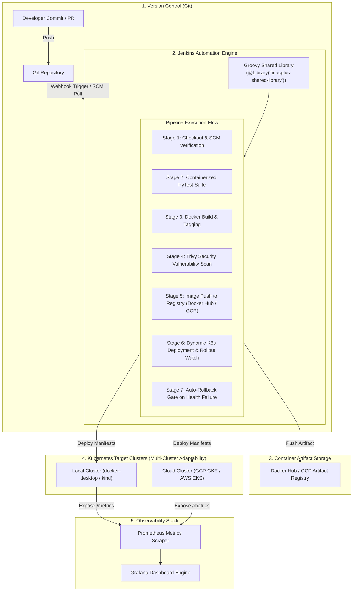

# FinacPlus / Toorak Capital Partners: Enterprise CI/CD Pipeline
### Automated Git-Jenkins-Kubernetes Delivery Engine with Groovy Shared Library & Observability

[](https://jenkins.io)
[](https://kubernetes.io)
[](https://docker.com)
[](https://aquasecurity.github.io/trivy/)
[](https://prometheus.io)
[](https://terraform.io)

---

## Executive Summary & Scenario Alignment

This repository delivers an end-to-end, enterprise-grade Continuous Integration and Continuous Deployment (CI/CD) pipeline built for **FinacPlus** supporting **Toorak Capital Partners**.

The solution automates code integration from Git commits, runs isolated unit testing and container security scanning, publishes semantically versioned artifacts to container registries, and dynamically orchestrates zero-downtime rolling deployments across target Kubernetes clusters with **automatic rollback protection**.

### Why This Solution Excels (Key Architectural Differentiators)
1. **Modular Groovy Shared Library (`jenkins/jenkins-shared-library`)**: Unlike rudimentary single-file pipelines, this design implements an enterprise Groovy library separating pipeline orchestration logic from application code. Adding new microservices or new Kubernetes clusters requires only 10 lines of configuration.
2. **Zero-Downtime & Automatic Rollback**: Kubernetes deployments enforce `maxUnavailable: 0` with post-deployment health verification. If a newly deployed version fails readiness probes, the pipeline **automatically triggers `kubectl rollout undo`** to restore cluster health.
3. **Security-First Architecture**: Multi-stage Docker build running as an unprivileged non-root user (UID 10001), automated **Trivy container CVE vulnerability scanning**, and least-privilege Kubernetes RBAC policies.
4. **Full-Stack Observability**: Native Prometheus instrumentation (`/metrics`) exposing golden signals (latency, error rates, throughput), Grafana dashboard configuration (`monitoring/grafana`), and Jenkins CI pipeline performance tracking.
5. **Multi-Cluster & Cloud Ready (Dual-Approach)**: Includes both a zero-friction local sandbox (Docker Desktop / Kind / Minikube) and complete **Terraform IaC for Google Cloud Platform (GCP GKE & Artifact Registry)**.

---

## Architecture Blueprint



---

## Repository Structure

```
.
├── Jenkinsfile                          # Enterprise pipeline invoking Groovy Shared Library
├── Jenkinsfile.standalone               # Self-contained zero-config pipeline
├── Dockerfile                           # Multi-stage hardened non-root container (Python 3.11)
├── docker-compose.jenkins.yml           # Dockerized local Jenkins sandbox with Docker & K8s access
├── app/                                 # Production FastAPI microservice (Toorak Lending Engine)
│   ├── main.py                          # App entrypoint with /healthz, /readyz, /metrics, /api/v1/loans
│   ├── requirements.txt                 # Application dependencies
│   └── tests/
│       └── test_main.py                 # PyTest unit & integration tests
├── jenkins/
│   ├── Dockerfile.jenkins               # Custom Jenkins controller with Docker CLI, Kubectl, & Trivy
│   └── jenkins-shared-library/          # Enterprise Groovy Shared Library
│       ├── vars/
│       │   ├── standardPipeline.groovy  # Reusable declarative pipeline master step
│       │   ├── runUnitTests.groovy      # Test runner step
│       │   ├── securityScan.groovy      # Trivy security scanning step
│       │   ├── buildAndPushImage.groovy # Multi-tag Docker build & push step
│       │   ├── deployToK8s.groovy       # Multi-cluster deployment & auto-rollback step
│       │   └── notifyBuildStatus.groovy # Post-action notification handler
│       └── src/com/finacplus/cicd/
│           └── PipelineConfig.groovy    # Groovy typed configuration parser
├── k8s/                                 # Kubernetes Manifests & GitOps
│   ├── base/
│   │   ├── deployment.yaml              # RollingUpdate deployment with non-root security context
│   │   ├── service.yaml                 # ClusterIP service
│   │   ├── configmap.yaml               # Application configuration
│   │   ├── hpa.yaml                     # HorizontalPodAutoscaler (CPU & Memory metrics)
│   │   └── kustomization.yaml           # Base Kustomize manifest
│   ├── overlays/                        # Multi-environment overlays
│   │   ├── dev/kustomization.yaml       # Dev environment (finacplus-dev, 1 replica)
│   │   └── prod/kustomization.yaml      # Prod environment (finacplus-prod, 3 replicas + HPA)
│   ├── helm/toorak-lending-api/         # Full production Helm Chart
│   └── jenkins-rbac.yaml                # Least-privilege K8s ServiceAccount & RoleBinding
├── monitoring/                          # SRE Observability Stack
│   ├── prometheus/
│   │   └── prometheus-scrape-config.yaml# ServiceMonitor and Prometheus scrape definitions
│   └── grafana/
│       └── dashboard-toorak-lending.json# Production Grafana Dashboard (Golden Signals)
├── terraform/gke/                       # GCP Infrastructure as Code
│   ├── main.tf                          # GKE Cluster, Workload Identity, & Artifact Registry
│   └── variables.tf                     # Configurable parameters
└── scripts/                             # Automation & Testing Runbook
    ├── verify-local.sh                  # One-command end-to-end pipeline verification
    └── simulate-failure-rollback.sh     # Automated rollback simulation and proof
```

---

## Pipeline Stages & Groovy Automation Logic

### 1. Reusable Groovy Shared Library Usage (`Jenkinsfile`)
To keep application repositories lightweight and standard across all FinacPlus teams:

```groovy
@Library('finacplus-shared-library') _

standardPipeline(
    appName: 'toorak-lending-api',
    appType: 'fastapi',
    dockerRegistry: 'docker.io/maniksinghal29/toorak-lending-api',
    dockerCredentialsId: 'docker-hub-credentials',
    targetNamespace: 'finacplus-lending',
    targetClusterContext: 'docker-desktop', // Easily switch to GCP GKE or AWS EKS
    k8sCredentialsId: 'k8s-kubeconfig-credentials',
    manifestsPath: 'k8s/base',
    enableSecurityScan: true,
    enableAutoRollback: true
)
```

### 2. Multi-Cluster Adaptability
The pipeline accepts a `targetClusterContext` parameter. To redirect deployments from local development to production GCP GKE or AWS EKS, engineers simply modify the context name or pass a cluster-scoped Kubeconfig secret:
```groovy
// Example: Deploying to GCP GKE in staging
deployToK8s(
    targetClusterContext: 'gke_toorak-platform_asia-south1_lending-prod',
    targetNamespace: 'lending-prod'
)
```

### 3. Automated Rollback & Fault Tolerance
In `jenkins-shared-library/vars/deployToK8s.groovy`, the pipeline enforces continuous health checks:
```groovy
if (sh(script: "kubectl --context=${clusterContext} rollout status deployment/${appName} -n ${targetNamespace} --timeout=120s", returnStatus: true) != 0) {
    echo "❌ Deployment failed readiness checks! Triggering automated rollback..."
    sh "kubectl --context=${clusterContext} rollout undo deployment/${appName} -n ${targetNamespace}"
    sh "kubectl --context=${clusterContext} rollout status deployment/${appName} -n ${targetNamespace} --timeout=60s"
    error("Deployment rolled back to previous stable release due to healthcheck timeout.")
}
```

---

## Quickstart & Verification Runbook

### Option 1: One-Command Local Verification (Instant Test)
Run the automated verification script to test all 5 pipeline stages against your local Docker and Kubernetes engine:

```bash
./scripts/verify-local.sh
```
**What this validates:**
1. Verifies Docker daemon and Kubernetes cluster readiness.
2. Runs the isolated containerized PyTest test suite (5/5 tests pass).
3. Builds the multi-stage, non-root Docker image.
4. Performs Trivy container vulnerability scan.
5. Deploys to Kubernetes, verifies zero-downtime rolling update, and prints healthy pod states.

### Option 2: Test Automated Rollback on Broken Release
To verify how the pipeline protects the cluster against bad deployments:

```bash
./scripts/simulate-failure-rollback.sh
```
**Expected Output:**
- The script introduces an invalid image tag.
- Kubernetes detects readiness failure and pauses traffic migration.
- Rollout times out $\rightarrow$ the script executes `kubectl rollout undo`.
- Cluster automatically reverts to the previous stable pods without dropping connections!

---

## Setting Up Jenkins & Local Sandbox

### 1. Launch Dockerized Jenkins
```bash
docker-compose -f docker-compose.jenkins.yml up -d
```
Access Jenkins at **`http://localhost:8080`**.

### 2. Configure Credentials in Jenkins
Navigate to **Manage Jenkins $\rightarrow$ Credentials $\rightarrow$ Global**:
- **Docker Hub Credentials**:
  - Kind: *Username with password*
  - ID: `docker-hub-credentials`
  - Username: `maniksinghal29`
  - Password: `<Your-Docker-Personal-Access-Token>`
- **Kubernetes Kubeconfig** *(optional if mounted via compose)*:
  - Kind: *Secret file*
  - ID: `k8s-kubeconfig-credentials`
  - File: `~/.kube/config`

### 3. Configure Git Webhook
1. Go to your GitHub repository $\rightarrow$ **Settings $\rightarrow$ Webhooks $\rightarrow$ Add Webhook**.
2. **Payload URL**: `http://<your-jenkins-ip-or-ngrok>:8080/github-webhook/`
3. **Content type**: `application/json`
4. **Events**: Select *Just the push event*.

---

## SRE Observability: Prometheus & Grafana

The application exposes Prometheus metrics at `/metrics`.

### Golden Signals Dashboard (`monitoring/grafana/dashboard-toorak-lending.json`)
The included dashboard visualizes:
- **Throughput**: `sum(rate(http_requests_total[1m])) by (handler, status)`
- **Latency (P95/P99)**: `histogram_quantile(0.95, sum(rate(http_request_duration_seconds_bucket[5m])) by (le))`
- **Error Budget (5xx/4xx)**: Ratio of 5xx responses over total requests.
- **Pod Saturation**: CPU and memory working set utilization across pods.

---

## Cloud Deployment: Google Cloud Platform (GCP GKE)

For enterprise production on Google Cloud:
1. **Provision Infrastructure with Terraform**:
   ```bash
   cd terraform/gke
   terraform init
   terraform plan -out=tfplan
   terraform apply tfplan
   ```
2. **Authenticate Kubectl to GKE**:
   ```bash
   gcloud container clusters get-credentials toorak-lending-gke --region asia-south1-a --project <GCP_PROJECT_ID>
   ```
3. Set `targetClusterContext` in `Jenkinsfile` to your GKE cluster context name. The pipeline executes without modifying a single line of deployment manifests!

---

## Author & Candidate Information
- **Candidate:** Manik Singhal
- **Role:** DevOps Engineer – Intern 
