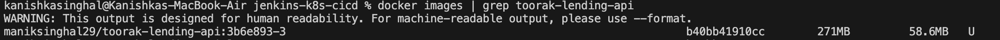

# CI/CD Pipeline: Git → Jenkins → Kubernetes

A CI/CD pipeline that automates the full delivery cycle — from Git push to a running deployment on Kubernetes — using Jenkins and Groovy scripting.

Built as a DevOps assignment for **FinacPlus / Toorak Capital Partners**.

---

## What This Does

1. Developer pushes code to Git → Jenkins picks it up via webhook
2. Jenkins runs unit tests, builds a Docker image, scans it for vulnerabilities (Trivy)
3. Jenkins deploys the image to a Kubernetes cluster with rolling updates
4. If the new deployment fails health checks, Jenkins **automatically rolls back** to the previous working version

---

## Architecture

```
Developer → Git Push → GitHub Webhook → Jenkins Pipeline
                                            │
                                    ┌───────┴───────┐
                                    │  Stage 1: SCM  │ (Checkout & Commit Audit)
                                    │  Stage 2: Test │ (PyTest in virtualenv)
                                    │  Stage 3: Build│ (Docker Build + Trivy + Push)
                                    │  Stage 4: Deploy│(kubectl → K8s cluster)
                                    │     └── Rollback if health check fails
                                    └───────────────┘
```

---

## Repository Structure

```
.
├── Jenkinsfile                       # Main pipeline — all stages in one file
├── Dockerfile                        # Multi-stage build, runs as non-root user
├── .gitignore
├── .dockerignore
│
├── app/                              # FastAPI microservice
│   ├── main.py                       # Endpoints: /healthz, /readyz, /metrics, /api/v1/loans
│   ├── requirements.txt
│   └── tests/
│       └── test_main.py              # Unit tests covering health, metrics, and API
│
├── k8s/                              # Kubernetes manifests
│   ├── deployment.yaml               # RollingUpdate, probes, resource limits, non-root
│   ├── service.yaml                  # ClusterIP service
│   ├── configmap.yaml                # App environment config
│   └── jenkins-rbac.yaml             # Least-privilege ServiceAccount for Jenkins
│
└── screenshots/                      # Pipeline execution and cluster verification screenshots
```

---

## Pipeline Stages (Jenkinsfile)

The `Jenkinsfile` uses Jenkins Declarative Pipeline with Groovy scripting. Here is the stage view from Build #3 showing a complete successful run:


Here's what each stage does:

### Stage 1: Checkout & Verification
Prints the current branch, commit SHA, and workspace path for build traceability.

### Stage 2: Unit Testing
Runs `pytest` inside a clean `python:3.11-slim` container against `app/tests/`. All 5 unit tests pass:
- Root endpoint status (`/`)
- Kubernetes liveness probe (`/healthz`)
- Kubernetes readiness probe (`/readyz`)
- Prometheus metrics endpoint (`/metrics`)
- Loan application submission and retrieval flow (`/api/v1/loans`)


### Stage 3: Docker Build + Security Scan
- Builds the image using `Dockerfile` and tags it with commit SHA and build number (`<commit-sha>-<build-number>`) instead of just `latest`
- Scans the image with **Trivy** for CRITICAL and HIGH vulnerabilities before pushing
- Pushes the image to Docker Hub using credentials stored in Jenkins

### Stage 4: Kubernetes Deployment + Auto-Rollback
- Creates the target namespace if it doesn't exist (`finacplus-dev`)
- Applies K8s manifests (`deployment.yaml`, `service.yaml`, `configmap.yaml`)
- Updates the deployment image to the newly built tag
- Monitors rollout with `kubectl rollout status --timeout=120s`
- **If the rollout fails** (crash loop, failed health probes, timeout):
  - Runs `kubectl rollout undo` to immediately restore the previous stable version
  - Marks the build as failed

This is the core reliability feature — bad code never stays running in the cluster.

---

## How Scalability is Handled

The assignment asks for a solution that works across **different Git repositories and Kubernetes clusters**.

### Multiple Clusters
The pipeline uses parameterized `CLUSTER_CONTEXT` and `ENVIRONMENT`. To deploy to a different cluster, you just select the parameters when triggering the build:


```groovy
// Local development
CLUSTER_CONTEXT = 'docker-desktop'

// Production GKE
CLUSTER_CONTEXT = 'gke_project_region_cluster-name'
```

No manifest changes needed — `kubectl --context=<name>` handles the routing.

### Multiple Repositories
The pipeline is designed to be easily adapted for any service. By parameterizing `APP_NAME`, `DOCKER_REGISTRY`, and cluster contexts in the `environment {}` block, this single `Jenkinsfile` can be dropped into other microservice repos with minimal changes to environment variables.

---

## Security Practices

| Layer | What's Done |
|-------|-------------|
| **Container** | Multi-stage Dockerfile; runs as non-root user (UID 10001) |
| **Image Scanning** | Trivy scans for CRITICAL/HIGH CVEs before pushing to registry |
| **Kubernetes** | `runAsNonRoot: true` in pod security context; readiness + liveness probes |
| **RBAC** | `jenkins-rbac.yaml` creates a dedicated ServiceAccount with only the permissions Jenkins needs (deployments, services, pods, configmaps) |
| **Credentials** | Docker Hub credentials stored in Jenkins Credential Store, never hardcoded |

---

## Monitoring

The application exposes Prometheus metrics at `/metrics` using `prometheus_client`.

In `k8s/deployment.yaml`, the pod template includes standard Prometheus scrape annotations:
```yaml
annotations:
  prometheus.io/scrape: "true"
  prometheus.io/path: "/metrics"
  prometheus.io/port: "8000"
```

This is the standard cloud-native approach: any Prometheus instance running in the cluster automatically discovers and scrapes these pods without needing custom CRDs or separate configuration files.

You can verify the metrics directly:
```bash
curl http://localhost:8000/metrics
```

---

## Setup & Reproduction Guide

### 1. Environment Prerequisites
- **Local Kubernetes Cluster**: In Docker Desktop, go to **Settings → Kubernetes** and make sure **Enable Kubernetes** is checked (see screenshot `08`). Verify with `kubectl cluster-info`.
- **Jenkins**: Run locally (`java -jar jenkins.war --httpPort=8085` or via Homebrew/Docker) with Git, Docker Pipeline, and Credentials Binding plugins installed.
- **CLI Tools**: Ensure `docker` and `kubectl` are installed and available in your `$PATH`.

### 2. Configure Credentials
In Jenkins → **Manage Jenkins → Credentials → Global**:

- **Docker Hub**: Kind = *Username with password*, ID = `docker-hub-credentials` (stores username & PAT).
- **Kubeconfig** (optional for remote clusters): Kind = *Secret file*, ID = `k8s-kubeconfig-credentials`. For local Docker Desktop, `kubectl` automatically uses `~/.kube/config`.


### 3. Configure Git Webhook
In your GitHub repo → **Settings → Webhooks → Add Webhook**:
- **Payload URL**: `http://<your-jenkins-host>:8080/github-webhook/`
- **Content type**: `application/json`
- **Events**: Just the push event

*(Note: For local testing on `localhost`, builds are triggered via **Build with Parameters** or an `ngrok` tunnel, as GitHub requires a publicly reachable address to deliver webhook payloads).*

### 4. Create Pipeline Job
In Jenkins → **New Item → Pipeline**:
- Definition: **Pipeline script from SCM**
- SCM: **Git**, Repository URL: `https://github.com/manik-singhal/jenkins-k8s-cicd.git`
- Script Path: `Jenkinsfile`


---

## Verification (Screenshots)

Below are the verification screenshots from the live pipeline run and local deployment:

### 1. Kubernetes Pods & Service Running
Both pods are running healthy with 0 restarts and the ClusterIP service is routing traffic in the `finacplus-dev` namespace:


### 2. Docker Image Verification
Verifying the built image locally via CLI and inside Docker Desktop (confirming it is actively in use by the running Kubernetes pods):




### 3. Kubernetes Cluster in Docker Desktop
Single-node Kubernetes cluster running healthy in Docker Desktop settings:


---

## Production Considerations

For local validation, this assignment was executed using Docker Desktop and a local Jenkins controller. In an enterprise cloud production setup (such as AWS EKS or GCP GKE), the following standard practices would be adopted:

- **Managed Kubernetes**: Run on **AWS EKS** or **GCP GKE** across multiple availability zones with managed node groups for high availability.
- **IAM Authentication**: Replace static kubeconfig files with cloud-native IAM integration — **IAM Roles for Service Accounts (IRSA)** on AWS or **Workload Identity** on GCP — granting Jenkins short-lived, least-privilege tokens.
- **Private Image Registry**: Use **Amazon ECR** or **GCP Artifact Registry** backed by private VPC endpoints with vulnerability scanning policies blocking critical CVEs.
- **Secrets Management**: Store database passwords and API keys in **AWS Secrets Manager** or **HashiCorp Vault**, syncing them into Kubernetes pods using the **External Secrets Operator (ESO)**.
- **Ingress & TLS**: Expose services through an **ALB / NGINX Ingress Controller** with **cert-manager** automating TLS certificate issuance and renewals.
- **Observability & Alerting**: Scrape application metrics via Prometheus Operator, create service dashboards in Grafana, and send alerts for rollout failures or elevated 5xx error rates to Slack or PagerDuty.

---

## Author
- Manik Singhal


