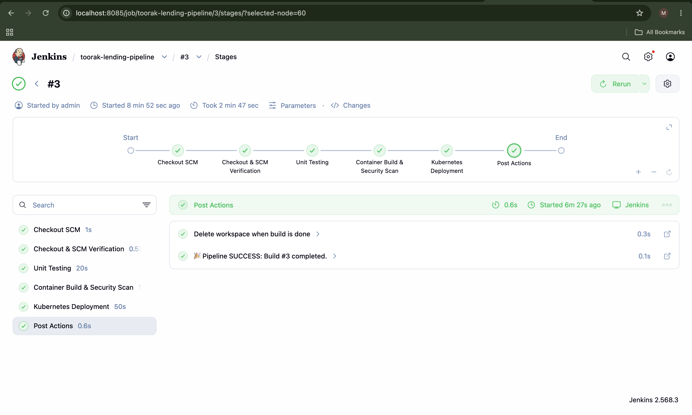
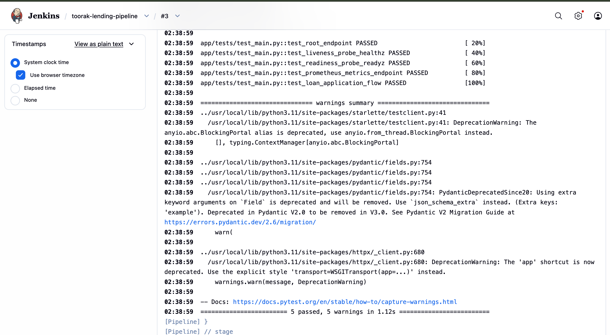
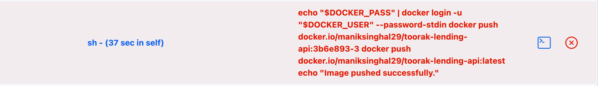
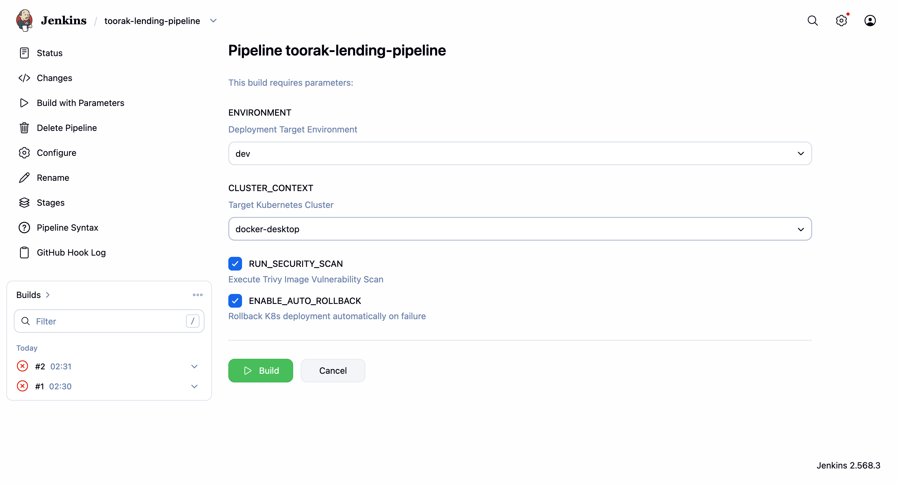
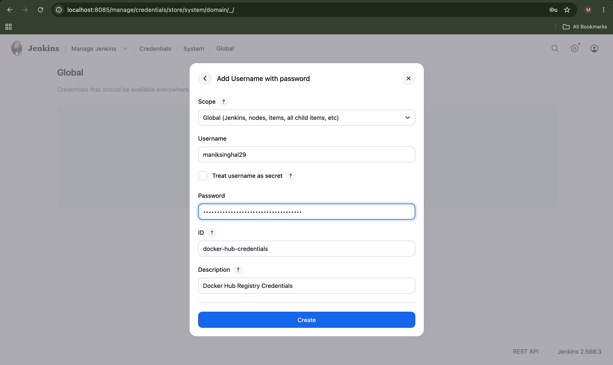
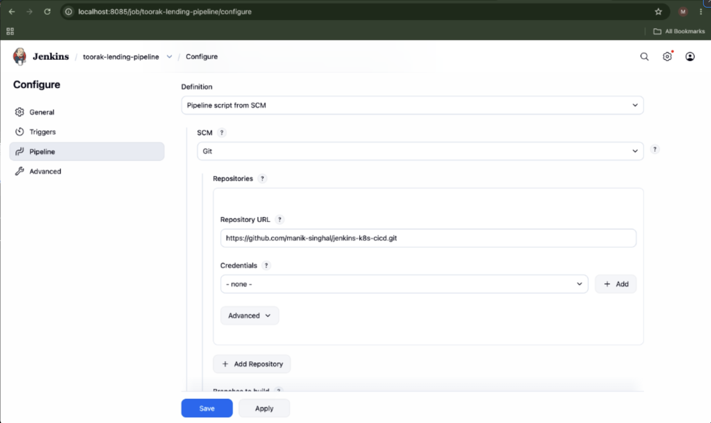
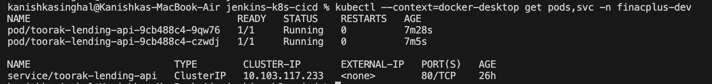
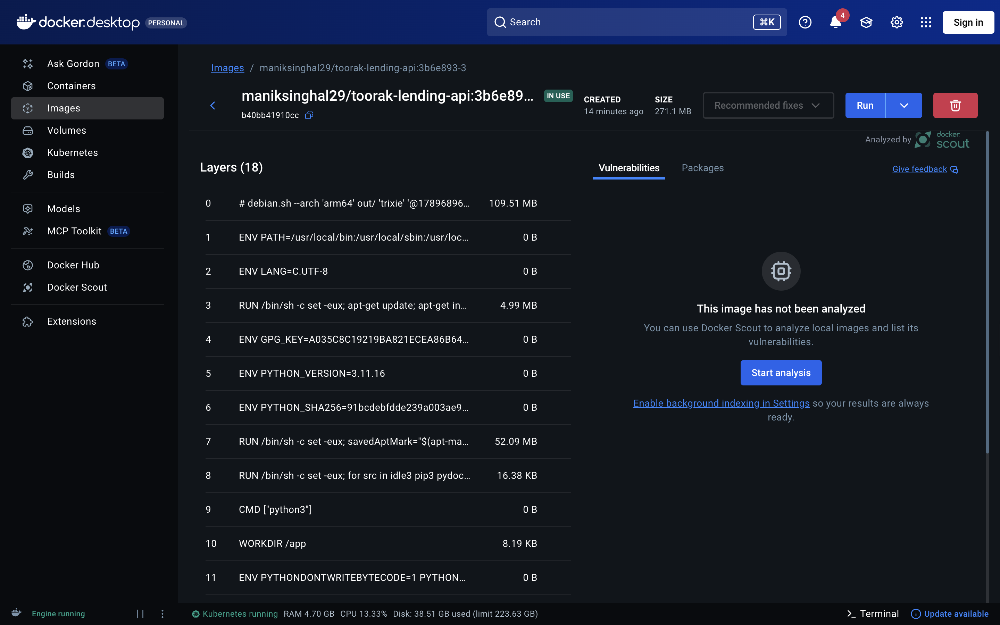
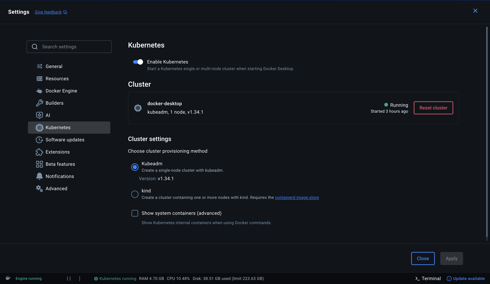

# CI/CD Pipeline: Git → Jenkins → Kubernetes

A CI/CD pipeline that automates the full delivery cycle — from Git push to a running deployment on Kubernetes — using Jenkins and Groovy scripting.

Built as a DevOps assignment for **FinacPlus / Toorak Capital Partners**.

---

## What This Does

1. Developer pushes code to Git → Jenkins picks it up via webhook
2. Jenkins runs unit tests, builds a Docker image, scans it for vulnerabilities (Trivy)
3. Jenkins deploys the image to a Kubernetes cluster with rolling updates
4. If the new deployment fails health checks, Jenkins **automatically rolls back** to the previous working version

---

## Architecture

```
Developer → Git Push → GitHub Webhook → Jenkins Pipeline
                                            │
                                    ┌───────┴───────┐
                                    │  Stage 1: SCM  │ (Checkout & Commit Audit)
                                    │  Stage 2: Test │ (PyTest in virtualenv)
                                    │  Stage 3: Build│ (Docker Build + Trivy + Push)
                                    │  Stage 4: Deploy│(kubectl → K8s cluster)
                                    │     └── Rollback if health check fails
                                    └───────────────┘
```

---

## Repository Structure

```
.
├── Jenkinsfile                       # Main pipeline — all stages in one file
├── Dockerfile                        # Multi-stage build, runs as non-root user
├── .gitignore
├── .dockerignore
│
├── app/                              # FastAPI microservice
│   ├── main.py                       # Endpoints: /healthz, /readyz, /metrics, /api/v1/loans
│   ├── requirements.txt
│   └── tests/
│       └── test_main.py              # Unit tests covering health, metrics, and API
│
└── k8s/                              # Kubernetes manifests
    ├── deployment.yaml               # RollingUpdate, probes, resource limits, non-root
    ├── service.yaml                  # ClusterIP service
    ├── configmap.yaml                # App environment config
    └── jenkins-rbac.yaml             # Least-privilege ServiceAccount for Jenkins
```

---

## Pipeline Stages (Jenkinsfile)

The `Jenkinsfile` uses Jenkins Declarative Pipeline with Groovy scripting. Below is the live execution view from Build #3 showing all stages succeeding end-to-end:



Here's what each stage does:

### Stage 1: Checkout & Verification
Prints the current branch, commit SHA, and workspace path for traceability.

### Stage 2: Unit Testing
Runs `pytest` inside an isolated Python 3.11 container (`python:3.11-slim`) against `app/tests/`. All 5 unit tests pass:
- Health endpoints (`/healthz`, `/readyz`)
- Prometheus metrics endpoint (`/metrics`)
- Loan application API flow (POST + GET)



### Stage 3: Docker Build + Security Scan
- Builds a multi-stage Docker image tagged with `<commit-sha>-<build-number>` for traceability (not just `latest`)
- Runs **Trivy** vulnerability scanner against the built image to catch CRITICAL/HIGH CVEs before pushing
- Authenticates securely via Jenkins credentials and pushes the image to Docker Hub



### Stage 4: Kubernetes Deployment + Auto-Rollback
- Creates the target namespace if it doesn't exist
- Applies K8s manifests (`deployment.yaml`, `service.yaml`, `configmap.yaml`)
- Updates the deployment image to the newly built tag
- Watches `kubectl rollout status --timeout=120s`
- **If the rollout fails** (pods crash, fail readiness probes, or timeout):
  - Runs `kubectl rollout undo` to restore the previous stable version
  - Marks the build as failed

This is the core reliability feature — bad code never stays running in the cluster.

---

## How Scalability is Handled

The assignment asks for a solution that works across **different Git repositories and Kubernetes clusters**.

### Multiple Clusters
The pipeline uses parameterized `CLUSTER_CONTEXT` and `ENVIRONMENT`. To deploy to a different cluster, you just select the parameters when triggering the build:



```groovy
// Local development
CLUSTER_CONTEXT = 'docker-desktop'

// Production GKE
CLUSTER_CONTEXT = 'gke_project_region_cluster-name'
```

No manifest changes needed — `kubectl --context=<name>` handles the routing.

### Multiple Repositories
The pipeline is designed to be easily adapted for any service. By parameterizing `APP_NAME`, `DOCKER_REGISTRY`, and cluster contexts in the `environment {}` block, this single `Jenkinsfile` can be dropped into other microservice repos with minimal changes to environment variables.

---

## Security Practices

| Layer | What's Done |
|-------|-------------|
| **Container** | Multi-stage Dockerfile; runs as non-root user (UID 10001) |
| **Image Scanning** | Trivy scans for CRITICAL/HIGH CVEs before pushing to registry |
| **Kubernetes** | `runAsNonRoot: true` in pod security context; readiness + liveness probes |
| **RBAC** | `jenkins-rbac.yaml` creates a dedicated ServiceAccount with only the permissions Jenkins needs (deployments, services, pods, configmaps) |
| **Credentials** | Docker Hub credentials stored in Jenkins Credential Store, never hardcoded |

---

## Monitoring

The application exposes Prometheus metrics at `/metrics` using `prometheus_client`.

In `k8s/deployment.yaml`, the pod template includes standard Prometheus scrape annotations:
```yaml
annotations:
  prometheus.io/scrape: "true"
  prometheus.io/path: "/metrics"
  prometheus.io/port: "8000"
```

This is the standard cloud-native approach: any Prometheus instance running in the cluster automatically discovers and scrapes these pods without needing custom CRDs or separate configuration files.

You can verify the metrics directly:
```bash
curl http://localhost:8000/metrics
```

---

## Setup Instructions

### Prerequisites
- Jenkins server with Git, Docker Pipeline, Credentials Binding, and Kubernetes CLI plugins installed
- Docker and `kubectl` available on the Jenkins agent
- A running Kubernetes cluster (Docker Desktop, Minikube, or cloud cluster)

### 1. Add Credentials in Jenkins
Go to **Manage Jenkins → Credentials → Global**:

- **Docker Hub**: Kind = *Username with password*, ID = `docker-hub-credentials`
- **Kubeconfig** (optional if running outside cluster): Kind = *Secret file*, ID = `k8s-kubeconfig-credentials`



### 2. Set Up Git Webhook
In your GitHub repo → **Settings → Webhooks → Add Webhook**:
- **URL**: `http://<your-jenkins-ip>:8080/github-webhook/`
- **Content type**: `application/json`
- **Events**: Just the push event

### 3. Create Pipeline Job
In Jenkins → **New Item → Pipeline**:
- Definition: **Pipeline script from SCM**
- SCM: Git, Repository URL: `https://github.com/manik-singhal/jenkins-k8s-cicd.git`
- Script Path: `Jenkinsfile`



---

## Infrastructure & Deployment Verification

Here is the operational verification of the Docker containers and Kubernetes resources running on the local cluster:

### Kubernetes Workload Status
Verification of active pods and ClusterIP service running in the `finacplus-dev` namespace:



### Local Docker Image & Container Status
The built image is verified locally via Docker CLI and inspected in Docker Desktop confirming it is active and in-use:




### Docker Desktop Kubernetes Cluster
The underlying single-node Kubernetes cluster running via Docker Desktop:



---

## Author
- Manik Singhal

